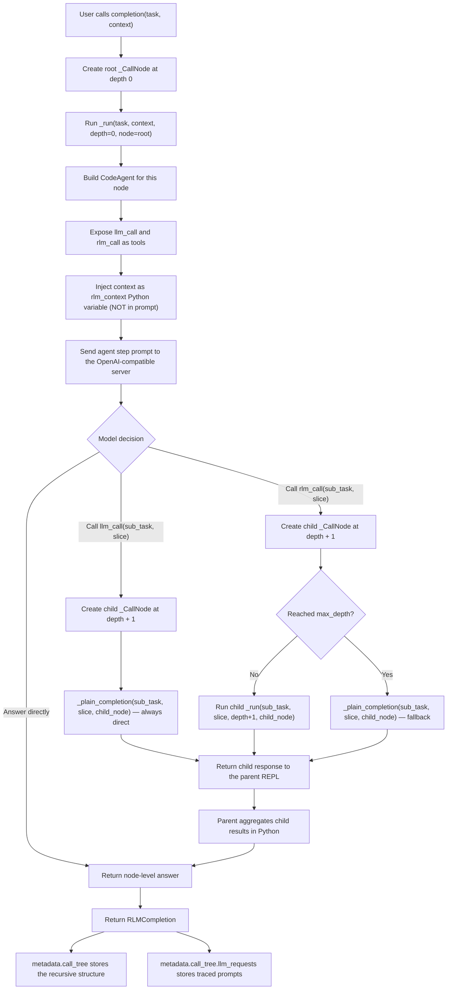

# RLMAgent Internal Flow

This document describes how `RLMAgent` turns a single prompt into a recursive
tree of LLM calls, and where prompt tracing is captured.

## High-level flow



## Two tools — `llm_call` vs `rlm_call`

The REPL exposes two tools that mirror the official paper's `llm_query` /
`rlm_query` distinction:

| Tool | Behaviour | When to use |
|------|-----------|-------------|
| `llm_call(sub_task, context_slice)` | Direct, non-recursive LLM call.  Fast and lightweight. | Leaf-level queries on chunks small enough to answer in one shot. |
| `rlm_call(sub_task, context_slice)` | Recursive RLM sub-call.  Child gets its own REPL. | Complex sub-tasks that may themselves need further decomposition. |

The model **decides freely** how to orchestrate — it can split by paragraphs,
by regex patterns, by sentence boundaries, or by any other Python logic:

```python
# Example 1 — paragraph-by-paragraph with direct LLM calls
paragraphs = [p for p in rlm_context.split("\n\n") if p.strip()]
summaries = [llm_call(f"Summarise paragraph {i+1}", p)
             for i, p in enumerate(paragraphs)]
final_answer("\n".join(summaries))

# Example 2 — recursive binary split for very large contexts
mid   = len(rlm_context) // 2
left  = rlm_call("Analyse first half",  rlm_context[:mid])
right = rlm_call("Analyse second half", rlm_context[mid:])
final_answer(left + " " + right)

# WRONG — never embed the full context in a sub-call string
rlm_call(f"Summarise: {rlm_context}")
```

The context (`rlm_context`) is injected into the REPL as a Python variable
**before** the first agent step.  It never appears in the prompt text.

## Split-validation guidance

The system prompt includes an explicit instruction for the agent to **validate
its split logic** before making sub-calls:

> After splitting `rlm_context` into chunks, print the number of chunks and a
> short preview (first 80 chars) of each one.  If the result looks wrong (too
> many fragments, empty chunks, or headers mixed with content), adjust your
> splitting logic before making any sub-calls.  A bad split will cascade into
> bad answers.

This was added after an early version of notebook 03 used ambiguous section
separators (`=== Name ===`) which caused the agent's `split("===")` to produce
12 alternating header/content fragments instead of the expected 6 sections.  The
current document format uses unambiguous block headers
(`SECTION: Name` between lines of `=` characters), and the validation hint
ensures the agent catches any remaining splitting errors before they propagate
through the recursion tree.

## Prompt trace capture points

There are two places where prompts leave the application and are sent to the
LLM server:

1. Agent steps via `CodeAgent`
2. Direct / fallback completions via `_plain_completion`

The implementation records both.

### 1. Agent step tracing

`_build_model(node, phase="agent_step")` creates a tracing model wrapper around
`OpenAIServerModel`.

That wrapper intercepts each call to `generate()` and `generate_stream()` after
smolagents has prepared the final request payload. The captured trace includes:

- recursion depth
- step number within the current node
- phase (`agent_step`)
- the exact `messages` payload sent to the OpenAI-compatible API
- stop sequences and response format, when present
- available tool names
- the full request payload dictionary used for the API call

This means you can inspect not only the task prompt, but the full message list
as smolagents actually submitted it.

### 2. Plain completion tracing

Both `llm_call` and the `rlm_call` depth-limit fallback go through
`_plain_completion(sub_task, context, node=child_node)`.

Before sending the request through the OpenAI SDK, the method records a
`plain_completion` trace entry on that child node. This gives full visibility
into all leaf calls.

## Data model

Each `_CallNode` now stores:

- `task`: original task for that node
- `depth`: recursion depth
- `context_size`: byte-length of the context slice at this level
- `response`: node-level final answer
- `children`: recursive subcalls
- `llm_requests`: every outbound request generated while solving that node
- `agent_steps`: intermediate code actions, observations, and errors from the CodeAgent REPL

Each `llm_requests` entry includes:

- `phase`
- `depth`
- `model_name`
- `node_step`
- `messages`
- `stop_sequences`
- `response_format`
- `tool_names`
- `request_payload`

Each `agent_steps` entry includes:

- `step_number`
- `model_output` (the LLM's reasoning text)
- `code_action` (the Python code the agent generated)
- `observations` (REPL output / printed text)
- `is_final_answer`
- `tool_calls` (if any tool was invoked)
- `error` (if the step raised an exception)

## How to inspect traces after a run

Enable tracing:

```python
agent = RLMAgent(
    base_url="http://localhost:8080/v1",
    model_name="local-model",
    capture_prompt_traces=True,
)
result = agent.completion("Solve this by decomposition.")
```

Then inspect them in one of two ways.

### Flat view

```python
for request in result.iter_llm_requests():
    print(request["depth"], request["phase"], request["node_step"])
    for message in request["messages"]:
        print(message["role"], message.get("content", ""))
```

### Formatted notebook-friendly view

```python
print(result.format_prompt_trace())
```

## Practical interpretation

When you read the trace output, keep this distinction in mind:

- `_CallNode.task` is the logical task given to that recursive node
- `llm_requests[*].messages` is the actual payload sent to the LLM server

Those are related, but not identical. The second view is the one you want when
you need to debug exact prompt construction or inspect what each subagent step
actually saw.

## Agent step capture

After each `agent.run()` call, the RLMAgent extracts intermediate step data
from the CodeAgent's memory and stores it in `_CallNode.agent_steps`.  This
captures the Python code the model wrote at each step, the REPL output
(observations), any errors, and whether the step was the final answer.

This data is available both in the JSON metadata and the HTML visualizer.

```python
# Inspect agent steps programmatically
for step in result.metadata["call_tree"].get("agent_steps", []):
    print(f"Step {step['step_number']}:")
    if step.get("code_action"):
        print(f"  Code: {step['code_action'][:200]}")
    if step.get("observations"):
        print(f"  Output: {step['observations'][:200]}")
```

## Interactive HTML visualizer

The `rlm_visualizer` module generates a self-contained HTML file from any
`RLMCompletion` or previously saved JSON trace.  The HTML requires no server —
open it directly in any browser.

```python
from rlm_visualizer import save_html, save_json, load_json

# From a live result
save_html(result, "trace.html")

# Or use convenience methods
result.save_html("trace.html")
result.save_json("trace.json")

# Reload from JSON later
data = load_json("trace.json")
save_html(data, "trace_reloaded.html")
```

The visualizer shows:

- **Left panel**: interactive call tree with expand/collapse
- **Right panel**: selected node details
  - Task and response text
  - Agent steps (code, observations, errors)
  - LLM request payloads (full message lists)
  - Timing, depth, and context-size metadata
- **Stats bar**: total nodes, depth, duration, LLM requests